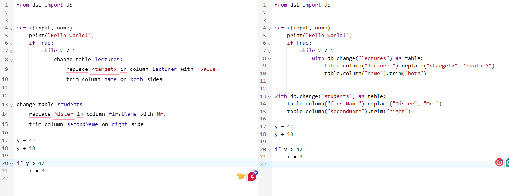

<!-- _class:
- lead -->
# EasyPyTorch - Virtual DSLs for editing of PyTorch code

Dmitry Savelyev, Shengzhe Xu, Frederick Vandermoeten

---
<!-- paginate: true -->
## Overview

- **Intro**: PyTorch and DSLs
- Approach
- Timeline

---
<!--- header: Example -->

Example: Existing Project

---
<!-- header: Introduction -->

### PyTorch

- PyTorch is a popular deep learning framework
- Main features:
  - Tensor computing on the GPU
  - Neural Networks build on automatic differentiation
  - Handling of datasets
  - Training and evaluation of models

### Domain Specific Language (DSL)

- Specialized language for a specific domain
- "virtual DSL": a DSL that is only present in the code editor

---
<!-- header: Approach -->

### Goals

- **Simplify** the creation and modification of PyTorch code
- Make PyTorch code **easier to understand**

### Possible DSL features

- Visual representation of:
  - the neural network
  - Tensor operations
  - Training runs, both setup and results (with e.g. TensorBoard)
  - datasets, e.g. showing the head of the dataset

---
<!--- header: Example --->

### Example: Neural Network

---
<!-- header: Prior Work & Tools -->

## Prior Work

- vDSL Paper
- MSc Thesis
- [PyTorch Lighting](https://lightning.ai/docs/pytorch/stable/), [fastai](https://www.fast.ai/)

## Tools

- Svelte
- Jupyter, VSCode
- CodeMirror

---
<!-- header: Timeline -->

## Timeline

- **first two weeks**: get in touch with earlier groups, get to know the codebase + vscode extension
- week 3-5: analyze PyTorch code for useful widgets + some test widgets
- week 6-8: implementation of no-runtime widgets
- week 9-13: implementation of runtime widgets
- week 14-15: preparing demo and presentation
- last week of the semester (February): presentation + demo
- lecture-free time: finishing touches, finishing documentation
- final meeting & final presentation: early march

---
<!-- header: Questions -->

## Thank you for your attention!

Any questions?
